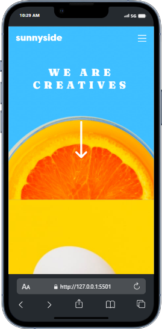

# Frontend Mentor - Sunnyside agency landing page solution

This is a solution to the [Sunnyside agency landing page challenge on Frontend Mentor](https://www.frontendmentor.io/challenges/sunnyside-agency-landing-page-7yVs3B6ef). Frontend Mentor challenges help you improve your coding skills by building realistic projects.

## Table of contents

- [Overview](#overview)
  - [The challenge](#the-challenge)
  - [Screenshot](#screenshot)
  - [Links](#links)
  - [Built with](#built-with)
- [Author](#author)

## Overview

### The challenge

Users should be able to:

- View the optimal layout for the site depending on their device's screen size
- See hover states for all interactive elements on the page

### Screenshot

 

### Links

- Solution URL: [Solutio](https://github.com/AhmNice/Sunnyside-agency-landing-page-)
- Live Site URL: [Live site](https://your-live-site-url.com)

### Built with

- Semantic HTML5 markup
- CSS custom properties
- Flexbox
- CSS Grid
## Author

- Website - [Musa Muhammed Awwal](https://www.your-site.com)
- Frontend Mentor - [@AhmNice](https://www.frontendmentor.io/profile/Ahmnice)
- Twitter - [@ahm_nice](https://www.twitter.com/ahm_nice)
